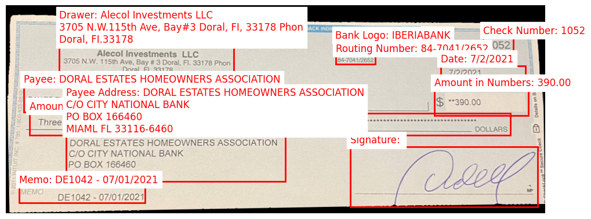

# CheckGuard: Advancing Stolen Check Detection with a Cross-Modal Image-Text Benchmark Dataset

**This paper is for CIKM 2024 Resource Paper.**


## Install

If you are not using Linux, do *NOT* proceed, see instructions for [macOS](https://github.com/haotian-liu/LLaVA/blob/main/docs/macOS.md) and [Windows](https://github.com/haotian-liu/LLaVA/blob/main/docs/Windows.md).


1. Install Package
```Shell
conda create -n llava python=3.10 -y
conda activate llava
pip install --upgrade pip  # enable PEP 660 support
pip install -e .
```

2. Install additional packages for training cases
```
pip install -e ".[train]"
pip install flash-attn --no-build-isolation
```

### Upgrade to latest code base

```Shell
git pull
pip install -e .
conda install nb_conda_kernels

# if you see some import errors when you upgrade,
# please try running the command below (without #)
# pip install flash-attn --no-build-isolation --no-cache-dir

```

## Models

- All models are stored [here](https://drive.google.com/drive/folders/1rNT26fInFuduqmKgZpwcx8RjuQ3jDc4n?usp=sharing).

## Data Visualization Code

- The code for data visualization is provided in the data_visualization folder


## Training Scripts

- All PEFT-based models' training scripts are stored in the `script-peft` folder in the repo.

## Inference

- To run inference with the PEFT models, please use the `inference.ipynb` file in the `cikm-resource` folder.

## Custom Data Training

- To train the model with your own data, use the following format:
    ```json
    [
        {
            "id": "ad555ef3-2b24-47e9-a12c-768d198f751a",
            "image": "03/dataset/images/train/photo_7167@25-02-2022_18-36-29_0.png",
            "conversations": [
                {
                    "from": "human",
                    "value": "<image>\nCan you tell me the dollar amount on this check?"
                },
                {
                    "from": "gpt",
                    "value": "The dollar amount on the check is $355.00."
                }
            ],
        },
        ...
    ]
    ```
- The data generation code is provided in `generate_json/other_class.ipynb` file in the `cikm-resource` folder.


## PEFT Command for fine-tuning:


```Shell

# fine-tuning mistral model with two gpus
bash scripts_peft/mistral/lora/llava-lora-mistral-r128a256/wholeimage/bank_no/finetune_lora_llava_mistral.sh "0,1"  


```

Thanks to the authors of [LLaVA-1.5](https://github.com/haotian-liu/LLaVA) for their foundational code and contributions.

## Related Projects

- [Instruction Tuning with GPT-4](https://github.com/Instruction-Tuning-with-GPT-4/GPT-4-LLM)
- [LLaVA-Med: Training a Large Language-and-Vision Assistant for Biomedicine in One Day](https://github.com/microsoft/LLaVA-Med)
